# Backend architecture

`backend-api` is the ASP.NET Core (.NET 10) service behind fajneoceny — a study
app where students organise subjects/lessons, generate AI flashcards, review
them with Anki-style spaced repetition, track grades against a syllabus scheme,
and export flashcard audio. This document describes how the backend is put
together and where the extension seams are.

## Stack

| Concern | Choice |
|---|---|
| Runtime / framework | .NET 10, ASP.NET Core Minimal APIs |
| Persistence | Entity Framework Core + SQLite (`app.db`) |
| Auth | JWT bearer tokens; email/password + Google ID-token sign-in |
| LLM | Any OpenAI-compatible `/chat/completions` endpoint (OpenAI by default) |
| TTS | Google Cloud Text-to-Speech (default) or local Piper; WAV either way |
| Config | `appsettings.json` + `appsettings.Development.json`, bound to options classes |

## Architectural style

The backend is a **minimal-API application with a service layer**, not a
controller/MVC app. There are three concentric rings:

1. **Endpoints** (`Endpoints/`) — thin HTTP handlers grouped by resource
   (auth, subjects, lessons, decks, flashcards, settings). Each file is a
   vertical slice: it maps routes, validates input, talks to `AppDbContext`,
   and delegates domain work to services. DTOs are declared next to the
   endpoints that use them. Handlers receive their dependencies by
   parameter injection from the DI container.
2. **Services** (`Services/`) — the business logic, grouped by capability
   (`Ai/`, `Flashcards/`, `Grading/`, `Tts/`, `Storage/`). Every capability
   with more than one plausible implementation sits behind an interface, so
   endpoints depend on abstractions.
3. **Data + Domain** (`Data/`, `Domain/`) — EF Core `AppDbContext`, the entity
   types, and migrations. Domain types are plain POCOs.

Auth (`Auth/`) is a cross-cutting concern used by both the endpoints and the
data layer.

## Layers and their pieces

### Endpoints
`AuthEndpoints`, `SubjectEndpoints`, `LessonEndpoints`, `DeckEndpoints`,
`FlashcardEndpoints`, `SettingsEndpoints`, `UniversityEndpoints`,
`CommunityEndpoints`, and the admin trio `AdminEndpoints` /
`AdminModerationEndpoints` / `AdminSuperEndpoints`. Registered in `Program.cs` via `app.Map*Endpoints()`
extension methods. All resource endpoints `RequireAuthorization()`; only the
auth routes and `GET /api/universities` (used by the registration screen) are
anonymous.

### Services

**`Services/Ai/`** — the LLM transport seam.
- `IChatCompletionClient` abstracts a chat-completions backend
  (`CompleteAsync` + `IsConfigured`).
- `OpenAiChatCompletionClient` is the only implementation; it speaks the
  OpenAI-compatible wire format, which also covers local Ollama. HTTP,
  auth, JSON-mode shaping, and response parsing live here once.
- `AiOptions` holds `BaseUrl` / `ApiKey` / `Model`.

**`Services/Flashcards/`** — generation + scheduling.
- `IFlashcardGenerationService` with two implementations:
  `AiFlashcardGenerationService` (LLM, with retry/top-up/dedup rounds) and
  `HeuristicFlashcardGenerationService` (offline regex/cloze generator). The AI
  service takes the heuristic one as an injected fallback.
- `FlashcardPrompt` builds the generation prompt (kept out of the service).
- `ISpacedRepetitionService` → `AnkiScheduler` (SM-2/Anki-style scheduling).
- `IDailyFlashcardSelector` → `DailyFlashcardSelector` (due + new-card budget).
- `SchedulerSettings` / `SpacedRepetitionState` support the above.

**`Services/Grading/`** — syllabus parsing + grade maths.
- `IGradingSchemeExtractor` with `AiGradingSchemeExtractor` (LLM parse of a
  syllabus into weighted components) and `HeuristicGradingSchemeExtractor`
  (regex) as the injected fallback — same pattern as flashcards.
- `IGradeCalculationService` → `GradeCalculationService` (weighted averages).
- `IDocumentTextExtractionService` → `DocumentTextExtractionService` (pull text
  from uploaded files for both flashcards and grading).

**`Services/Tts/`** — audio.
- `ITextToSpeechService` → `GoogleTextToSpeechService` (default) or
  `PiperTextToSpeechService`, chosen by `Tts:Provider`. `SynthesizeAsync`
  returns a `SynthesizedSpeech(byte[] Data, SpeechAudioFormat Format)`; the
  contract requires WAV so downstream splicing is provider-agnostic. Note that
  `WavAudio` takes the output format from the **first** clip, so clips from
  different providers must never be mixed inside one export — hence a single
  global provider setting rather than a per-request choice.
- `IFlashcardAudioExportService` → `FlashcardAudioExportService` concatenates
  per-card question/answer clips with difficulty-scaled pauses using
  `WavAudio` (a tiny in-repo RIFF/WAVE splicer — no ffmpeg).
- `TtsOptions` nests provider-specific settings under `Piper`.

**`Services/Storage/`** — `IFileStorageService` → `FileStorageService`
(uploaded files under a configured root).

**`Services/Community/`** — the cross-user "Społeczność" feature:
- `CommunityQueries` is one of only **two** places allowed to call
  `IgnoreQueryFilters()` (the other is `Services/Admin/AdminQueries`). It
  exposes `VisibleLessonsForCourse` / `VisibleLessonById`, which encode the
  single visibility invariant (lesson `IsShared` and its subject linked to a
  university course). Handlers always project the result to DTOs and never
  hand the `IQueryable` around.
- `LessonPaging` holds the ordering/pagination shared by the student feed and
  the admin moderation feed, including the in-memory sort forced by SQLite's
  inability to `ORDER BY` a `DateTimeOffset` column.
- `CourseNaming` refuses a course name already taken in a university (by a
  course or a pending proposal), so near-duplicates never split a feed.
- `CommunityAuthorization` answers "is this user recognised" (has a
  `UniversityId`) and "may they access this course" (course belongs to their
  university). Every community route checks it and answers 404 on failure so
  existence isn't leaked.
- `LessonForkService` deep-copies a shared lesson (title, newest note, decks,
  cards) into the caller's subject and re-syncs it later. It never copies
  `SpacedRepetitionState`/`QuizSession`, and uses tracked adds/removes (not
  `ExecuteDelete`) so the `ContentUpdatedAt` bump fires.
- `CourseProposalReconciliation` links a subject to its course once an admin
  has approved the proposal (`Status='Approved'`, `CourseId` set); it runs at
  the top of `GET /api/subjects`.

**`Services/Admin/`** — moderation and curation, for the separate admin
account type:
- `AdminQueries` is the second sanctioned `IgnoreQueryFilters()` site. Two
  invariants are enforced by its **signatures**, not by discipline: every
  lesson query hard-codes `IsShared` (an admin can never read a lesson its
  author did not share), and every method requires a `universityId`, so
  forgetting to scope is a compile error rather than a cross-school leak.
- `AdminContext` re-reads the caller's `Admin` row on **every** admin request.
  Admin tokens last hours with no revocation list, so trusting the token would
  let a disabled or demoted admin keep their powers until it expired.
- `AdminAuthorization` / `AdminScopeResolver` answer "which university does
  this request act on?" — a normal admin's own (the requested id is ignored),
  or, for a super admin, the one named by `?universityId=`. This is what makes
  "a super admin can do anything a normal admin can, anywhere" one code path.
- `AdminAudit` writes `AdminAuditEntry` rows. Moderation destroys its own
  evidence — a taken-down lesson is unshared and therefore unreadable by every
  admin — so each entry carries a text **snapshot** taken at action time.
- `ShareBanQueries` is the single definition of "is this user banned from
  sharing right now?", since `ShareBan` is history (many rows, never
  overwritten) rather than a flag.
- `StatsClock` computes stat windows on **Europe/Warsaw** day boundaries.

### Auth
There are **two account types**, and they are mutually exclusive: a `User`
(student) and an `Admin`. Each has its own credentials, its own JWT audience,
its own signing key, and routes the other's token is refused on.

- `ICurrentUser` → `CurrentUser` resolves the caller's id from the JWT via
  `IHttpContextAccessor`. **`AppDbContext` depends on it** to scope data. It
  returns `Guid.Empty` for anything that is not a student token, so every
  per-user query filter matches nothing on an admin request — admin code fails
  closed on owned data and must go through `AdminQueries` instead.
- `ICurrentAdmin` → `CurrentAdmin` is its mirror for admin requests.
- `JwtTokenService` issues student tokens (30 days); `AdminTokenService`
  issues admin tokens (8 hours, audience `fajneoceny-admin`, its own
  `Jwt:AdminKey`). `GoogleTokenVerifier` validates Google ID tokens.
- `AuthClaims` defines the `fo_actor` / `fo_role` claims the policies key off.
  They are deliberately not named `typ`/`role`: `typ` is a reserved JOSE
  header parameter and `role` maps to `ClaimTypes.Role` under inbound claim
  mapping. **Never use `[Authorize(Roles = …)]` or `IsInRole()`** in this
  codebase — they match `ClaimTypes.Role`, not these claims, and fail in ways
  that are miserable to debug. Role checks go through the named policies.
- **Policies** (`Program.cs`): `DefaultPolicy` requires a *student* token, so
  the ~27 bare `RequireAuthorization()` calls became student-only with no
  edits. `FallbackPolicy` is the same policy, so an endpoint that forgets
  authorization entirely is student-only rather than public; the four
  genuinely public routes opt out with an explicit `.AllowAnonymous()`.
  `AuthPolicies.Admin` / `.SuperAdmin` gate `/api/admin/*`.
  `EndpointPolicyTests` walks the routing table and fails the build if a new
  admin route forgets its policy, or if a public route stops being anonymous.

### Data + Domain
- `AppDbContext` owns all `DbSet`s and the model config. Two cross-cutting
  behaviours matter:
  - **Per-user isolation**: every owned entity has a global query filter
    `e.UserId == currentUser.UserId`. (Note: `FindAsync` bypasses filters, so
    endpoints use `FirstOrDefaultAsync(e => e.Id == id)`.)
  - **Ownership stamping**: `SaveChanges[Async]` stamps `UserId` on new
    `IOwnedByUser` entities automatically. It **throws** rather than stamping
    `Guid.Empty`: that would silently write a row no query filter can ever
    return again, and only happens if an endpoint's authorization is
    misconfigured.
  - **Epoch-millis date columns**: SQLite stores `DateTimeOffset` as TEXT, and
    EF refuses to translate both `ORDER BY` (it throws `NotSupportedException`)
    and `WHERE` comparisons over such a column — which is why most date sorting
    in this codebase happens in memory. The columns the admin stats and
    moderation history must filter on (`Lesson.CreatedAt`, `User.LastLoginAt`,
    and the dates on `Admin` / `AdminAuditEntry` / `ShareEvent` / `ShareBan`)
    therefore carry a value converter to Unix epoch milliseconds, making them
    INTEGER columns EF can translate. The domain types stay `DateTimeOffset`;
    only the storage changes. The remaining date columns are deliberately left
    as TEXT — converting them would mean migrating live data for no present
    gain (see `AppDbContext.DateProperties`).
  - **`Lesson.ContentUpdatedAt` bump**: `SaveChanges[Async]` collects the
    lesson ids of any added/modified/deleted `Note`/`Deck`/`Flashcard` before
    the base save and then `ExecuteUpdate`s those lessons' `ContentUpdatedAt`.
    Community sorting and "your fork is behind the original" rely on it.
- Domain aggregate: `Subject → Lesson → {Note, Deck, Flashcard}`,
  `Subject → GradingScheme → GradingComponent → GradeEntry`, and
  `Flashcard → SpacedRepetitionState`. Cascade deletes are configured to match.
- Community entities: `University → UniversityCourse` are **shared reference
  data** (not `IOwnedByUser`, no query filter, curated only via SQL — see
  `docs/community-admin-sql.md`; `UniversitySeeder` seeds PJATK on startup).
  `User.UniversityId?` and `Subject.UniversityCourseId?` link into them (one
  subject per user per course). `CourseProposal` is user-owned.
  `LessonLike` is deliberately unfiltered (like counts are read cross-user) so
  endpoints set its `UserId` explicitly; `Lesson.LikeCount` is denormalised.
  `Lesson` also carries `IsShared`/`SharedAt` and fork provenance
  (`ForkedFromLessonId` as a bare scalar so the original may be deleted,
  `ForkedFromAuthorName` snapshot, `ForkSyncedAt`).

## Cross-cutting request flow

```
HTTP request
  → JWT bearer auth middleware (validates token)
  → endpoint handler (RequireAuthorization)
     → AppDbContext (queries auto-scoped to CurrentUser via query filters)
     → capability service(s) behind interfaces
  → SaveChangesAsync (stamps UserId on new owned rows)
  → DTO response
```

## Provider-swap seams (the extension points)

Two capabilities are designed to swap backends without touching callers:

- **LLM (OpenAI ↔ Ollama ↔ others).** Endpoints and generation/grading services
  depend on `IChatCompletionClient`, never on `HttpClient` or a specific
  provider. The concrete client is **hardwired in `Program.cs`** to
  `OpenAiChatCompletionClient`, which speaks any OpenAI-compatible
  `/chat/completions` endpoint. The deployed stack points at OpenAI itself;
  switching to a local Ollama (or Azure, OpenRouter, …) is pure config
  (`Ai:BaseUrl`/`Model`). Adding a non-OpenAI-shaped provider (e.g. Anthropic)
  means adding one `IChatCompletionClient` implementation and changing the
  single registration line.
- **TTS (Google Cloud ↔ local Piper).** Consumers depend on
  `ITextToSpeechService`, whose contract requires WAV output. Unlike the LLM
  seam this one is **selected by configuration** (`Tts:Provider`), not by a
  hardwired line, because the two backends have different deployment stories:
  `GoogleTextToSpeechService` needs an API key and nothing installed, while
  `PiperTextToSpeechService` needs a binary and a ~60 MB voice model present
  on disk. Google is the default and the only one the Docker image can run —
  the image deliberately ships no speech engine. Google is asked for LINEAR16,
  which comes back with a RIFF header, so no transcoding is needed.
  A third backend adds a class, a nested `TtsOptions` section and an enum
  value.

Both fall back gracefully: if no LLM is configured (`IsConfigured == false`) or
a call fails, the AI services defer to their offline heuristic implementation so
the feature never hard-fails.

## Composition root

`Program.cs` is the single composition root: it binds options sections, wires
every interface to its implementation (including the explicit AI→heuristic
fallback composition), configures EF Core, JWT auth, CORS, and OpenAPI, runs
migrations + `DeckBackfill` + `UniversitySeeder` on startup, and maps the
endpoint groups.

## Dependency graph

```mermaid
graph TD
    subgraph Endpoints
        AuthE[AuthEndpoints]
        SubjE[SubjectEndpoints]
        LessE[LessonEndpoints]
        DeckE[DeckEndpoints]
        FlashE[FlashcardEndpoints]
        SetE[SettingsEndpoints]
    end

    subgraph Auth
        ICU[/ICurrentUser/]
        CU[CurrentUser]
        JWT[JwtTokenService]
        GTV[GoogleTokenVerifier]
        CU -->|implements| ICU
    end

    subgraph Data
        DB[AppDbContext]
    end

    subgraph "Services: Flashcards"
        IFGS[/IFlashcardGenerationService/]
        AiFGS[AiFlashcardGenerationService]
        HeurFGS[HeuristicFlashcardGenerationService]
        ISRS[/ISpacedRepetitionService/]
        Anki[AnkiScheduler]
        IDFS[/IDailyFlashcardSelector/]
        DFS[DailyFlashcardSelector]
        AiFGS -.implements.-> IFGS
        HeurFGS -.implements.-> IFGS
        Anki -.implements.-> ISRS
        DFS -.implements.-> IDFS
    end

    subgraph "Services: AI"
        ICC[/IChatCompletionClient/]
        OpenAi[OpenAiChatCompletionClient]
        OpenAi -.implements.-> ICC
    end

    subgraph "Services: Grading"
        IGSE[/IGradingSchemeExtractor/]
        AiGSE[AiGradingSchemeExtractor]
        HeurGSE[HeuristicGradingSchemeExtractor]
        IGC[/IGradeCalculationService/]
        GC[GradeCalculationService]
        IDTE[/IDocumentTextExtractionService/]
        DTE[DocumentTextExtractionService]
        AiGSE -.implements.-> IGSE
        HeurGSE -.implements.-> IGSE
        GC -.implements.-> IGC
        DTE -.implements.-> IDTE
    end

    subgraph "Services: TTS"
        ITTS[/ITextToSpeechService/]
        Piper[PiperTextToSpeechService]
        IFAE[/IFlashcardAudioExportService/]
        FAE[FlashcardAudioExportService]
        Piper -.implements.-> ITTS
        FAE -.implements.-> IFAE
    end

    subgraph "Services: Storage"
        IFS[/IFileStorageService/]
        FS[FileStorageService]
        FS -.implements.-> IFS
    end

    %% Endpoint dependencies
    AuthE --> DB & JWT & GTV
    SubjE --> DB & IDTE & IFS & IGC & IGSE
    LessE --> DB & IDTE & IFS
    DeckE --> DB
    SetE --> DB
    FlashE --> DB & IFGS & ISRS & IDFS & IFAE

    %% Service-to-service
    DB --> ICU
    ICU -.resolved by.-> CU
    AiFGS --> ICC
    AiFGS -->|fallback| HeurFGS
    AiGSE --> ICC
    AiGSE -->|fallback| HeurGSE
    FAE --> ITTS
```



Arrows point from a dependent to its dependency. Solid arrows are runtime
dependencies (injected); dotted `implements` arrows tie a concrete class to the
interface callers actually depend on. Note the two swap seams: everything routes
through `IChatCompletionClient` and `ITextToSpeechService`, each with a single
concrete implementation hardwired in `Program.cs`.
