# Backend architecture

`backend-api` is the ASP.NET Core (.NET 10) service behind fajneoceny — a study
app where students organise subjects/lessons, generate AI flashcards, review
them with Anki-style spaced repetition, track grades against a syllabus scheme,
and export flashcard audio. This document describes how the backend is put
together and where the extension seams are.

## Stack

| Concern | Choice |
|---|---|
| Runtime / framework | .NET 10, ASP.NET Core Minimal APIs |
| Persistence | Entity Framework Core + SQLite (`app.db`) |
| Auth | JWT bearer tokens; email/password + Google ID-token sign-in |
| LLM | Any OpenAI-compatible `/chat/completions` endpoint (OpenAI or local Ollama) |
| TTS | Local Piper engine (subprocess), WAV output |
| Config | `appsettings.json` + `appsettings.Development.json`, bound to options classes |

## Architectural style

The backend is a **minimal-API application with a service layer**, not a
controller/MVC app. There are three concentric rings:

1. **Endpoints** (`Endpoints/`) — thin HTTP handlers grouped by resource
   (auth, subjects, lessons, decks, flashcards, settings). Each file is a
   vertical slice: it maps routes, validates input, talks to `AppDbContext`,
   and delegates domain work to services. DTOs are declared next to the
   endpoints that use them. Handlers receive their dependencies by
   parameter injection from the DI container.
2. **Services** (`Services/`) — the business logic, grouped by capability
   (`Ai/`, `Flashcards/`, `Grading/`, `Tts/`, `Storage/`). Every capability
   with more than one plausible implementation sits behind an interface, so
   endpoints depend on abstractions.
3. **Data + Domain** (`Data/`, `Domain/`) — EF Core `AppDbContext`, the entity
   types, and migrations. Domain types are plain POCOs.

Auth (`Auth/`) is a cross-cutting concern used by both the endpoints and the
data layer.

## Layers and their pieces

### Endpoints
`AuthEndpoints`, `SubjectEndpoints`, `LessonEndpoints`, `DeckEndpoints`,
`FlashcardEndpoints`, `SettingsEndpoints`. Registered in `Program.cs` via
`app.Map*Endpoints()` extension methods. All resource endpoints
`RequireAuthorization()`; only the auth routes are anonymous.

### Services

**`Services/Ai/`** — the LLM transport seam.
- `IChatCompletionClient` abstracts a chat-completions backend
  (`CompleteAsync` + `IsConfigured`).
- `OpenAiChatCompletionClient` is the only implementation; it speaks the
  OpenAI-compatible wire format, which also covers local Ollama. HTTP,
  auth, JSON-mode shaping, and response parsing live here once.
- `AiOptions` holds `BaseUrl` / `ApiKey` / `Model`.

**`Services/Flashcards/`** — generation + scheduling.
- `IFlashcardGenerationService` with two implementations:
  `AiFlashcardGenerationService` (LLM, with retry/top-up/dedup rounds) and
  `HeuristicFlashcardGenerationService` (offline regex/cloze generator). The AI
  service takes the heuristic one as an injected fallback.
- `FlashcardPrompt` builds the generation prompt (kept out of the service).
- `ISpacedRepetitionService` → `AnkiScheduler` (SM-2/Anki-style scheduling).
- `IDailyFlashcardSelector` → `DailyFlashcardSelector` (due + new-card budget).
- `SchedulerSettings` / `SpacedRepetitionState` support the above.

**`Services/Grading/`** — syllabus parsing + grade maths.
- `IGradingSchemeExtractor` with `AiGradingSchemeExtractor` (LLM parse of a
  syllabus into weighted components) and `HeuristicGradingSchemeExtractor`
  (regex) as the injected fallback — same pattern as flashcards.
- `IGradeCalculationService` → `GradeCalculationService` (weighted averages).
- `IDocumentTextExtractionService` → `DocumentTextExtractionService` (pull text
  from uploaded files for both flashcards and grading).

**`Services/Tts/`** — audio.
- `ITextToSpeechService` → `PiperTextToSpeechService`. `SynthesizeAsync` returns
  a `SynthesizedSpeech(byte[] Data, SpeechAudioFormat Format)`; the contract
  requires WAV so downstream splicing is provider-agnostic.
- `IFlashcardAudioExportService` → `FlashcardAudioExportService` concatenates
  per-card question/answer clips with difficulty-scaled pauses using
  `WavAudio` (a tiny in-repo RIFF/WAVE splicer — no ffmpeg).
- `TtsOptions` nests provider-specific settings under `Piper`.

**`Services/Storage/`** — `IFileStorageService` → `FileStorageService`
(uploaded files under a configured root).

### Auth
- `ICurrentUser` → `CurrentUser` resolves the caller's id from the JWT via
  `IHttpContextAccessor`. **`AppDbContext` depends on it** to scope data.
- `JwtTokenService` issues tokens; `GoogleTokenVerifier` validates Google
  ID tokens. Both read their own options section.

### Data + Domain
- `AppDbContext` owns all `DbSet`s and the model config. Two cross-cutting
  behaviours matter:
  - **Per-user isolation**: every owned entity has a global query filter
    `e.UserId == currentUser.UserId`. (Note: `FindAsync` bypasses filters, so
    endpoints use `FirstOrDefaultAsync(e => e.Id == id)`.)
  - **Ownership stamping**: `SaveChanges[Async]` stamps `UserId` on new
    `IOwnedByUser` entities automatically.
- Domain aggregate: `Subject → Lesson → {Note, Deck, Flashcard}`,
  `Subject → GradingScheme → GradingComponent → GradeEntry`, and
  `Flashcard → SpacedRepetitionState`. Cascade deletes are configured to match.

## Cross-cutting request flow

```
HTTP request
  → JWT bearer auth middleware (validates token)
  → endpoint handler (RequireAuthorization)
     → AppDbContext (queries auto-scoped to CurrentUser via query filters)
     → capability service(s) behind interfaces
  → SaveChangesAsync (stamps UserId on new owned rows)
  → DTO response
```

## Provider-swap seams (the extension points)

Two capabilities are designed to swap backends without touching callers:

- **LLM (Ollama ↔ OpenAI ↔ others).** Endpoints and generation/grading services
  depend on `IChatCompletionClient`, never on `HttpClient` or a specific
  provider. The concrete client is **hardwired in `Program.cs`** to
  `OpenAiChatCompletionClient`. Today, switching between OpenAI and Ollama is
  pure config (`Ai:BaseUrl`/`Model`); adding a non-OpenAI provider (e.g.
  Anthropic) means adding one `IChatCompletionClient` implementation and
  changing the single registration line.
- **TTS (local Piper → cloud, e.g. ElevenLabs).** Consumers depend on
  `ITextToSpeechService`, whose contract requires WAV output. Piper is
  hardwired in `Program.cs`. A new backend implements the interface (returning
  WAV — a cloud provider requesting PCM and wrapping it), gets its own nested
  `TtsOptions` section, and replaces the one registration line.

Both fall back gracefully: if no LLM is configured (`IsConfigured == false`) or
a call fails, the AI services defer to their offline heuristic implementation so
the feature never hard-fails.

## Composition root

`Program.cs` is the single composition root: it binds options sections, wires
every interface to its implementation (including the explicit AI→heuristic
fallback composition), configures EF Core, JWT auth, CORS, and OpenAPI, runs
migrations + `DeckBackfill` on startup, and maps the endpoint groups.

## Dependency graph

```mermaid
graph TD
    subgraph Endpoints
        AuthE[AuthEndpoints]
        SubjE[SubjectEndpoints]
        LessE[LessonEndpoints]
        DeckE[DeckEndpoints]
        FlashE[FlashcardEndpoints]
        SetE[SettingsEndpoints]
    end

    subgraph Auth
        ICU[/ICurrentUser/]
        CU[CurrentUser]
        JWT[JwtTokenService]
        GTV[GoogleTokenVerifier]
        CU -->|implements| ICU
    end

    subgraph Data
        DB[AppDbContext]
    end

    subgraph "Services: Flashcards"
        IFGS[/IFlashcardGenerationService/]
        AiFGS[AiFlashcardGenerationService]
        HeurFGS[HeuristicFlashcardGenerationService]
        ISRS[/ISpacedRepetitionService/]
        Anki[AnkiScheduler]
        IDFS[/IDailyFlashcardSelector/]
        DFS[DailyFlashcardSelector]
        AiFGS -.implements.-> IFGS
        HeurFGS -.implements.-> IFGS
        Anki -.implements.-> ISRS
        DFS -.implements.-> IDFS
    end

    subgraph "Services: AI"
        ICC[/IChatCompletionClient/]
        OpenAi[OpenAiChatCompletionClient]
        OpenAi -.implements.-> ICC
    end

    subgraph "Services: Grading"
        IGSE[/IGradingSchemeExtractor/]
        AiGSE[AiGradingSchemeExtractor]
        HeurGSE[HeuristicGradingSchemeExtractor]
        IGC[/IGradeCalculationService/]
        GC[GradeCalculationService]
        IDTE[/IDocumentTextExtractionService/]
        DTE[DocumentTextExtractionService]
        AiGSE -.implements.-> IGSE
        HeurGSE -.implements.-> IGSE
        GC -.implements.-> IGC
        DTE -.implements.-> IDTE
    end

    subgraph "Services: TTS"
        ITTS[/ITextToSpeechService/]
        Piper[PiperTextToSpeechService]
        IFAE[/IFlashcardAudioExportService/]
        FAE[FlashcardAudioExportService]
        Piper -.implements.-> ITTS
        FAE -.implements.-> IFAE
    end

    subgraph "Services: Storage"
        IFS[/IFileStorageService/]
        FS[FileStorageService]
        FS -.implements.-> IFS
    end

    %% Endpoint dependencies
    AuthE --> DB & JWT & GTV
    SubjE --> DB & IDTE & IFS & IGC & IGSE
    LessE --> DB & IDTE & IFS
    DeckE --> DB
    SetE --> DB
    FlashE --> DB & IFGS & ISRS & IDFS & IFAE

    %% Service-to-service
    DB --> ICU
    ICU -.resolved by.-> CU
    AiFGS --> ICC
    AiFGS -->|fallback| HeurFGS
    AiGSE --> ICC
    AiGSE -->|fallback| HeurGSE
    FAE --> ITTS
```



Arrows point from a dependent to its dependency. Solid arrows are runtime
dependencies (injected); dotted `implements` arrows tie a concrete class to the
interface callers actually depend on. Note the two swap seams: everything routes
through `IChatCompletionClient` and `ITextToSpeechService`, each with a single
concrete implementation hardwired in `Program.cs`.
